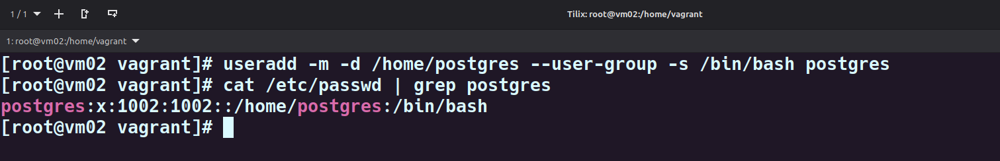
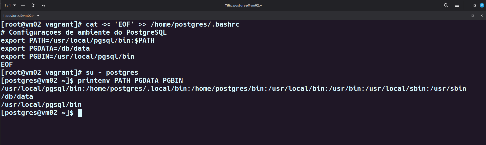
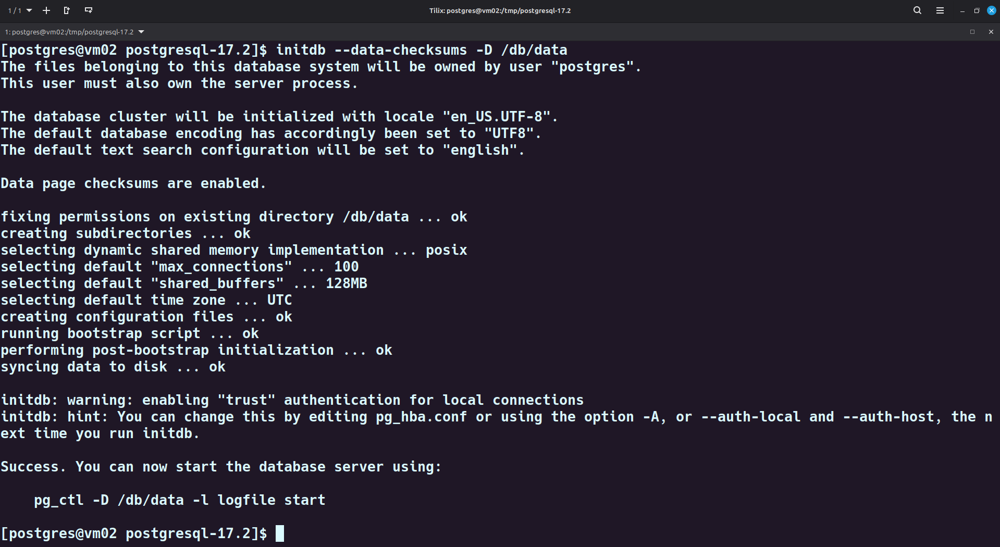
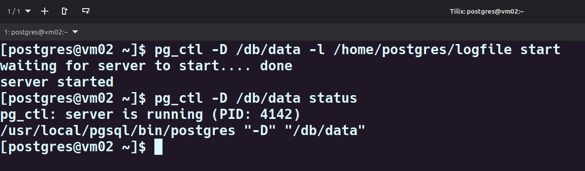
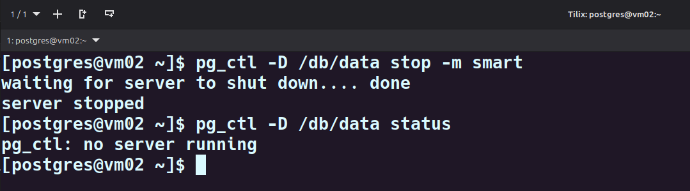
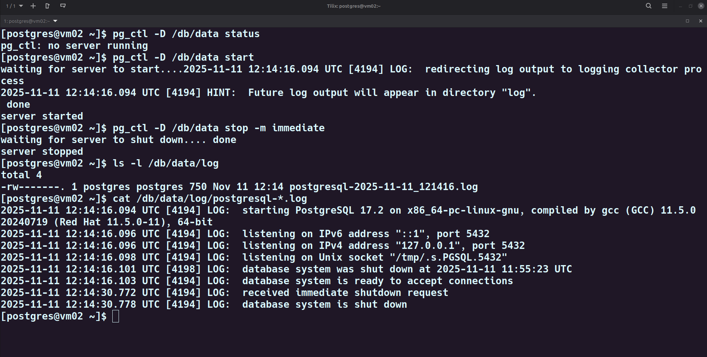
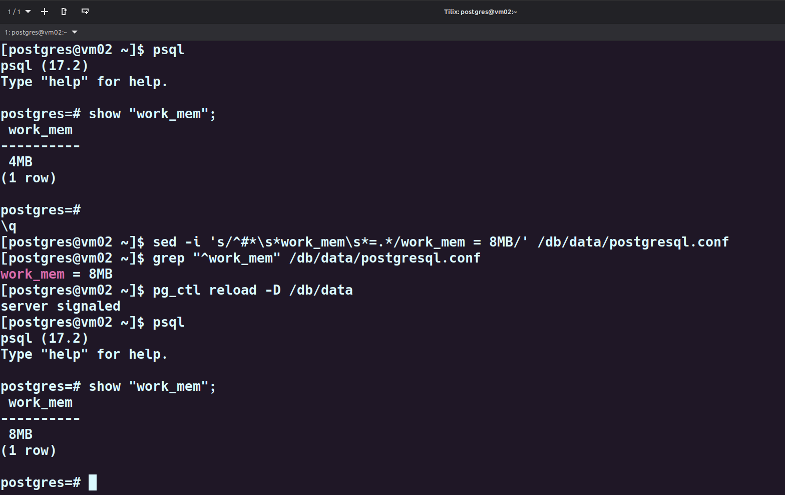

<table style="width:100%; border-collapse: collapse;">
  <tr>
    <td style="width: 120px;">
      
    </td>
    <td style="vertical-align: middle; text-align: left;">
      <h2 style="margin: 0;">Administração de Bancos de Dados</h2>
    </td>
  </tr>
</table>

<p style="margin: 4px 0 0 0; font-size: 14px; color: #333;">Aluno: <strong>Diego Vitor Soares dos Santos</strong></p>
<p style="margin: 4px 0 0 0; font-size: 14px; color: #333;">Cod. Turma: <strong>DES11</strong></p>
<p style="margin: 4px 0 0 0; font-size: 14px; color: #333;">Data: <strong>11 de novembro de 2025</strong></p>

#  **Respostas – Módulo 2: Operação e Configuração (PostgreSQL 17.2 no CentOS)**

## ⚙️ **Ambiente de Teste**

* **Virtualização:** Vagrant + VirtualBox
* **Sistema Operacional:** CentOS Stream 9 (Kernel 5.x)
* **PostgreSQL:** 17.2 (estável)
* **Fonte oficial:**
  [https://ftp.postgresql.org/pub/source/v17.2/postgresql-17.2.tar.gz](https://ftp.postgresql.org/pub/source/v17.2/postgresql-17.2.tar.gz)
* **Usuário administrador:** `root`
* **Usuário do PostgreSQL:** `postgres`
* **Diretórios principais:**
  * Binários: `/usr/local/pgsql`
  * Dados do cluster: `/db/data`
  * Home do usuário: `/home/postgres`
  * Arquivo de log inicial: `/home/postgres/logfile`
* **Pré-instalação e dependências**
   ```bash
   dnf install -y \
   gcc gcc-c++ make readline-devel zlib-devel wget \
   libicu-devel bison flex sudo glibc-langpack-en perl
   ```

## **Atividade 2.a – Criar conta**

O usuário `postgres` foi criado e configurado da seguinte forma:

```bash
useradd -m -d /home/postgres --user-group -s /bin/bash postgres
```



**Figura 1.** Processo de criação da conta para o usuário postgres.


As variáveis de ambiente foram definidas dentro do arquivo `/home/postgres/.bashrc`:

```bash
cat << 'EOF' >> /home/postgres/.bashrc
# Configurações de ambiente do PostgreSQL
export PATH=/usr/local/pgsql/bin:$PATH
export PGDATA=/db/data
export PGBIN=/usr/local/pgsql/bin
EOF

```



**Figura 2.** Processo de configuração das variáveis de ambiente.

---

## **Atividade 2.b – Inicialização da área de dados**

Dado que o postgres já foi complitado e gerado os binários.

A inicialização do cluster de dados foi feita com:

```bash
initdb --data-checksums -D /db/data
```



**Figura 3.** Processo de inicialização do cluster de dados do PostgreSQL, responsável pela criação da estrutura base do sistema de diretórios, geração dos arquivos de configuração padrão e ativação do mecanismo de verificação de integridade (`data checksums`).

### 📋 **Análise do que ocorre na inicialização**

Durante esse processo, o PostgreSQL:

* Cria toda a estrutura básica de diretórios (`base`, `global`, `pg_wal`, etc.);
* Gera os arquivos de configuração `postgresql.conf`, `pg_hba.conf` e `pg_ident.conf`;
* Cria o catálogo inicial do banco de dados (template0, template1 e postgres);
* Define o encoding padrão e as localizações regionais (`locale`);
* Configura o sistema de controle de integridade (`data checksums`) para detectar corrupção de blocos de dados.

---

## **Atividade 2.c – Inicialização do PostgreSQL**

### **Iniciar com log:**

```bash
pg_ctl -D /db/data -l /home/postgres/logfile start
```


**Figura 4.** Mostra o processo de inicialização do PostgreSQL

### **Parar com modo SMART:**

```bash
pg_ctl -D /db/data stop -m smart
```


**Figura 5.** Mostra o processo de parada do servidor PostgreSQL


### **Consultar log:**

```bash
cat /home/postgres/logfile
```
<div class="page-break"></div>
📄 O log mostra mensagens sobre:

```log
[postgres@vm02 ~]$ cat /home/postgres/logfile
2025-11-11 11:53:35.412 UTC [4142] LOG:  starting PostgreSQL 17.2 on x86_64-pc-linux-gnu, compiled by gcc (GCC) 11.5.0 20240719 (Red Hat 11.5.0-11), 64-bit
2025-11-11 11:53:35.413 UTC [4142] LOG:  listening on IPv6 address "::1", port 5432
2025-11-11 11:53:35.413 UTC [4142] LOG:  listening on IPv4 address "127.0.0.1", port 5432
2025-11-11 11:53:35.414 UTC [4142] LOG:  listening on Unix socket "/tmp/.s.PGSQL.5432"
2025-11-11 11:53:35.418 UTC [4145] LOG:  database system was shut down at 2025-11-10 23:41:40 UTC
2025-11-11 11:53:35.425 UTC [4142] LOG:  database system is ready to accept connections
2025-11-11 11:55:23.262 UTC [4142] LOG:  received smart shutdown request
2025-11-11 11:55:23.264 UTC [4142] LOG:  background worker "logical replication launcher" (PID 4148) exited with exit code 1
2025-11-11 11:55:23.264 UTC [4143] LOG:  shutting down
2025-11-11 11:55:23.265 UTC [4143] LOG:  checkpoint starting: shutdown immediate
2025-11-11 11:55:23.274 UTC [4143] LOG:  checkpoint complete: wrote 44 buffers (0.3%); 0 WAL file(s) added, 0 removed, 0 recycled; write=0.004 s, sync=0.002 s, total=0.010 s; sync files=11, longest=0.001 s, average=0.001 s; distance=294 kB, estimate=294 kB; lsn=0/1712270, redo lsn=0/1712270
2025-11-11 11:55:23.278 UTC [4142] LOG:  database system is shut down
```

Ao verificar o log podemos observar claramente:

* O **início** do PostgreSQL (`database system is ready to accept connections`);
* O **recebimento do comando de desligamento smart** (`received smart shutdown request`);
* E o **encerramento completo do sistema** (`database system is shut down`).

---

## **Atividade 2.d – Configurar o arquivo de log**

Edite o arquivo de configuração `/db/data/postgresql.conf` e altere:

```bash
logging_collector = on
```

Comando para alterar o valor:

```bash
sed -i 's/^#*\s*logging_collector\s*=.*/logging_collector = on/' /db/data/postgresql.conf
```

Verifique a alteração aplicada: 

```bash
grep "^logging_collector" /db/data/postgresql.conf
```

Resultado:

```bash
[postgres@vm02 ~]$ sed -i 's/^#*\s*logging_collector\s*=.*/logging_collector = on/' /db/data/postgresql.conf
[postgres@vm02 ~]$ grep "^logging_collector" /db/data/postgresql.conf
logging_collector = on
```

Em seguida, reinicie o PostgreSQL **sem especificar arquivo de log**:

```bash
pg_ctl -D /db/data start
```

Para encerrar rapidamente (modo **immediate**):

```bash
pg_ctl -D /db/data stop -m immediate
```

Verifique o diretório padrão de logs:

```bash
ls -l /db/data/log
cat /db/data/log/postgresql-*.log
```


**Figura 6.** Mostra o processo de configuração do logging_collector e log automático

**Diferença em relação ao item “c”:**  
Agora o log foi gravado **automaticamente dentro de `/db/data/log`** (por causa do `logging_collector = on`),  
e o desligamento é **imediato**, sem esperar as conexões terminarem, como acontecia com o modo **smart**.

---

<div class="page-break"></div>

## **Atividade 2.e – Recarregar as configurações**

1. Conectar-se ao PostgreSQL:

   ```bash
   psql
   ```

2. Verificar o parâmetro atual:

   ```sql
   show "work_mem";
   ```

3. Editar o arquivo `/db/data/postgresql.conf` e ajustar:

   ```bash
   work_mem = 8MB
   ```
   - Comando para alterar o valor:

   ```bash
   sed -i 's/^#*\s*work_mem\s*=.*/work_mem = 8MB/' /db/data/postgresql.conf
   ```

   - Verifique a alteração aplicada: 
   
   ```bash
   grep "^work_mem" /db/data/postgresql.conf
   ```


4. Recarregar configurações sem reiniciar:

   ```bash
   pg_ctl reload -D /db/data
   ```

5. Confirmar a alteração:

   ```sql
   show "work_mem";
   ```



**Figura 7.** Mostra o processo de configuração e aumento do work_mem de 4MB para 8MB

O parâmetro work_mem, inicialmente configurado com 4MB, foi alterado para 8MB no arquivo /db/data/postgresql.conf usando sed. Em seguida, o comando pg_ctl reload -D /db/data recarregou as configurações sem reiniciar o servidor. A verificação posterior via psql confirmou a atualização bem-sucedida do valor para 8MB.

---

## **Atividade 2.f – Ajustar o parâmetro `shared_buffers`**

O parâmetro `shared_buffers` define quanto da memória será reservada para cache interno do PostgreSQL.

**Valor Padrão:**
O valor padrão (ex: 128MB) é considerado extremamente baixo para a maioria dos ambientes

**Recomendação geral:**
Aproximadamente **25% da memória RAM total** do servidor.

> 💡 **Observação:** Como o servidor de teste possui **2 GB de memória**, será reservado **512 MB** para a **memória compartilhada**.


1. Conectar-se ao PostgreSQL:

   ```bash
   psql
   ```

2. Verificar o parâmetro atual:

   ```sql
   show "shared_buffers";
   ```

3. Editar o arquivo `/db/data/postgresql.conf` e ajustar:

   ```bash
   shared_buffers = 512MB
   ```

   - Comando para alterar o valor:

   ```bash
   sed -i 's/^#*\s*shared_buffers\s*=.*/shared_buffers = 512MB/' /db/data/postgresql.conf
   ```

   - Verifique a alteração aplicada:

   ```bash
   grep "^shared_buffers" /db/data/postgresql.conf
   ```

4. Recarregar configurações sem reiniciar:

   ```bash
   pg_ctl reload -D /db/data
   e
   pg_ctl restart -D /db/data
   ```
<div class="page-break"></div>

#### Resultado dos comandos acima:

```bash
[postgres@vm02 ~]$ psql
psql (17.2)
Type "help" for help.

postgres=# SHOW shared_buffers;
 shared_buffers 
----------------
 128MB
(1 row)

postgres=# 
\q
[postgres@vm02 ~]$ sed -i 's/^#*\s*shared_buffers\s*=.*/shared_buffers = 512MB/' /db/data/postgresql.conf
[postgres@vm02 ~]$ grep "^shared_buffers" /db/data/postgresql.conf
shared_buffers = 512MB
[postgres@vm02 ~]$ pg_ctl reload -D /db/data
server signaled
[postgres@vm02 ~]$ pg_ctl restart -D /db/data
waiting for server to shut down.... done
server stopped
waiting for server to start....2025-11-11 13:40:38.662 UTC [4421] LOG:  redirecting log output to logging collector process
2025-11-11 13:40:38.662 UTC [4421] HINT:  Future log output will appear in directory "log".
 done
server started
[postgres@vm02 ~]$ psql
psql (17.2)
Type "help" for help.

postgres=# SHOW shared_buffers;
 shared_buffers 
----------------
 512MB
(1 row)
```


---

## **Atividade 2.g – Permitir conexões remotas**


Configurei o PostgreSQL para **aceitar conexões remotas** de qualquer endereço IP.
Defini o parâmetro `listen_addresses = '*'` para que o servidor escutasse em todas as interfaces de rede disponíveis e adicionei a linha `host all all 0.0.0.0/0 trust` no arquivo `pg_hba.conf`, permitindo conexões de qualquer host sem exigir autenticação por senha.

Embora essa configuração seja adequada para **ambientes de teste ou laboratório**, nosso caso, **não é segura para produção**, pois remove restrições de acesso e autenticação.
Em um ambiente real, eu recomendaria a substituição dessa configuração por métodos mais seguros, como `md5` ou `scram-sha-256`, e limitaria o acesso a uma faixa de IPs específica, por exemplo:
`host all all 192.168.0.0/24 md5`.

```bash
sed -i "s/^#*\s*listen_addresses\s*=.*/listen_addresses = '*'/" /db/data/postgresql.conf
```

verificar o comando aplicado:
```bash
grep "^listen_addresses" /db/data/postgresql.conf
```

E no arquivo `pg_hba.conf`:

```bash
echo "host all all 0.0.0.0/0 trust" >> /db/data/pg_hba.conf
```

Essas duas linhas permitem que o PostgreSQL escute em todas as interfaces e aceite conexões externas (útil para testes e ambientes de desenvolvimento).

Agora é só Recarregar as configurações e reiniciar o servidor

```bash
pg_ctl reload -D /db/data
e
pg_ctl restart -D /db/data
```

Para testar a conexão remota, basta executar:

```
psql -h 192.168.56.15 -U postgres -d postgres
```
> 💡 **Observação:** o endereço da VM utilizada nesta atividade é ```192.168.56.15```

#### Resultados dos comandos realizados:

```bash
[postgres@vm02 ~]$ sed -i "s/^#*\s*listen_addresses\s*=.*/listen_addresses = '*'/" /db/data/postgresql.conf
[postgres@vm02 ~]$ grep "^listen_addresses" /db/data/postgresql.conf
listen_addresses = '*'
[postgres@vm02 ~]$ echo "host all all 0.0.0.0/0 trust" >> /db/data/pg_hba.conf
[postgres@vm02 ~]$ tail -n 5 /db/data/pg_hba.conf
# replication privilege.
local   replication     all                                     trust
host    replication     all             127.0.0.1/32            trust
host    replication     all             ::1/128                 trust
host all all 0.0.0.0/0 trust
[postgres@vm02 ~]$ pg_ctl reload -D /db/data
server signaled
[postgres@vm02 ~]$ pg_ctl restart -D /db/data
waiting for server to shut down.... done
server stopped
waiting for server to start....2025-11-11 14:14:57.560 UTC [4486] LOG:  redirecting log output to logging collector process
2025-11-11 14:14:57.560 UTC [4486] HINT:  Future log output will appear in directory "log".
 done
server started
[postgres@vm02 ~]$ psql -h 192.168.56.15 -U postgres -d postgres
psql (17.2)
Type "help" for help.

postgres=#
```

---

## **Atividade 2.h – Configurar `work_mem` sem editar o arquivo**

O valor pode ser alterado dinamicamente via comando SQL, sem modificar o arquivo de configuração:

```sql
SET work_mem = '16MB';
SHOW work_mem;
```

> 💡 **Observação:** Essa configuração vale apenas **para a sessão atual** do `psql`.


### Persistência do work_mem sem editar o arquivo
Para cumprir o objetivo da atividade — configurar work_mem sem editar diretamente o arquivo de configuração — o comando ideal seria:
```bash
ALTER SYSTEM SET work_mem = '16MB';
```
Depois disso, recarregar a configuração com:

```bash
SELECT pg_reload_conf();
```

#### Resultados dos comandos realizados:

```bash
[postgres@vm02 ~]$ psql
psql (17.2)
Type "help" for help.

postgres=# SHOW work_mem;
 work_mem 
----------
 8MB
(1 row)

postgres=# SET work_mem = '16MB';
SET
postgres=# SHOW work_mem;
 work_mem 
----------
 16MB
(1 row)

postgres=# 
\q
[postgres@vm02 ~]$ psql
psql (17.2)
Type "help" for help.

postgres=# SHOW work_mem;
 work_mem 
----------
 8MB
(1 row)

postgres=# ALTER SYSTEM SET work_mem = '16MB';
ALTER SYSTEM
postgres=# SELECT pg_reload_conf();
 pg_reload_conf 
----------------
 t
(1 row)

postgres=# 
\q
[postgres@vm02 ~]$ psql
psql (17.2)
Type "help" for help.

postgres=# SHOW work_mem;
 work_mem 
----------
 16MB
(1 row)
```

---

## **Atividade 2.i – Variável `PAGER` (scroll horizontal no psql)**

Para habilitar o **scroll horizontal** no terminal do `psql`, adicione ao `.bashrc` do usuário `postgres`:

```bash
export PAGER="less -S"
```

Em seguida, recarregue o ambiente:

```bash
source ~/.bashrc
```

Isso permite rolar horizontalmente resultados longos no terminal, evitando quebra automática de linha.

### 🧪 Exemplo prático com `\setenv PAGER 'less -RS'`

```sql
\setenv PAGER 'less -RS'
```

Esse comando define o pager do `psql` para usar o `less` com as opções:

- `-R`: mantém cores e caracteres especiais (como bordas de tabelas)
- `-S`: ativa o **scroll horizontal**, impedindo a quebra de linha automática

---

#### 🔍 Comparando modos de exibição

```sql
\x on
SELECT * FROM pg_settings WHERE name = 'work_mem';
```

**Resultado (modo expandido):**

```
[postgres@vm02 ~]$ psql
psql (17.2)
Type "help" for help.

postgres=# \setenv PAGER 'less -RS'
postgres=# \x on
Expanded display is on.
postgres=# SELECT * FROM pg_settings WHERE name = 'work_mem';
-[ RECORD 1 ]---+----------------------------------------------------------------------------------------------------------------------
name            | work_mem
setting         | 16384
unit            | kB
category        | Resource Usage / Memory
short_desc      | Sets the maximum memory to be used for query workspaces.
extra_desc      | This much memory can be used by each internal sort operation and hash table before switching to temporary disk files.
...
```

---

```sql
\x off
SELECT * FROM pg_settings WHERE name = 'work_mem';
```

<div class="page-break"></div>

**Resultado (modo padrão com scroll horizontal):**

```
postgres=# \x off
Expanded display is off.

   name   | setting | unit |        category         |                        short_desc                        |     >
----------+---------+------+-------------------------+----------------------------------------------------------+----->
 work_mem | 16384   | kB   | Resource Usage / Memory | Sets the maximum memory to be used for query workspaces. | This>
(1 row)
```

> Com o `less -RS`, você pode usar as **setas do teclado** para rolar horizontalmente e visualizar colunas que ultrapassam a largura da tela.

## 📂 Projetos

- [Admin Banco de Dados DES11](https://github.com/diegovitorav/admin-banco-dados-des11): Scripts, configurações e atividades relacionadas à administração de banco de dados.


## Referências (Material do Curso)

* ESCOLA SUPERIOR DE REDES (RNP). **Administração de Banco de Dados DES11: Capítulo 1 - Arquitetura e Instalação**. Material do curso DES11. (Arquivo: `DES11-Mod01_v02_24.pdf`).

* ESCOLA SUPERIOR DE REDES (RNP). **Administração de Banco de Dados DES11: Capítulo 2 - Operação e Configuração**. Material do curso DES11. (Arquivo: `DES11-Mod02-v02_24.pdf`).

* Hans-Jürgen Schönig (Packt). **Mastering PostgreSQL 17**. Elevate your database skills with advanced deployment, optimization, and security strategies (6th Edition). (Arquivo: `Mastering PostgreSQL 17.pdf`).