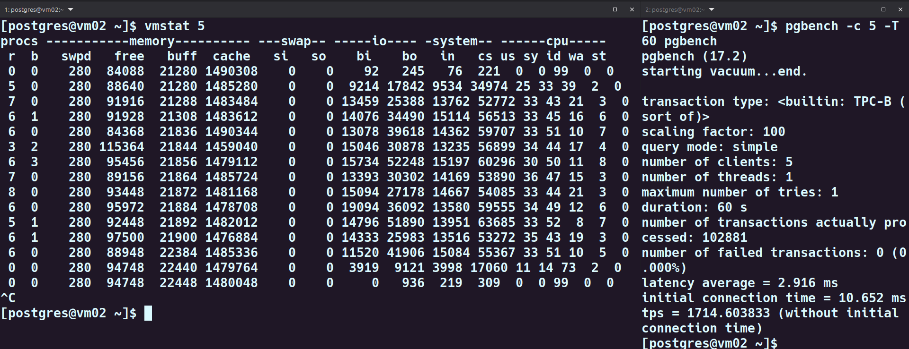
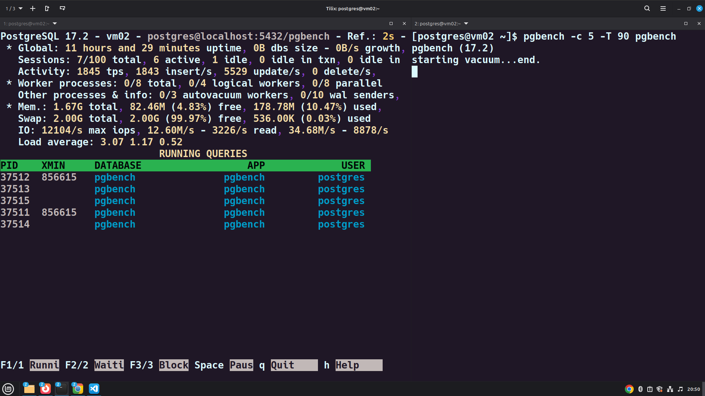
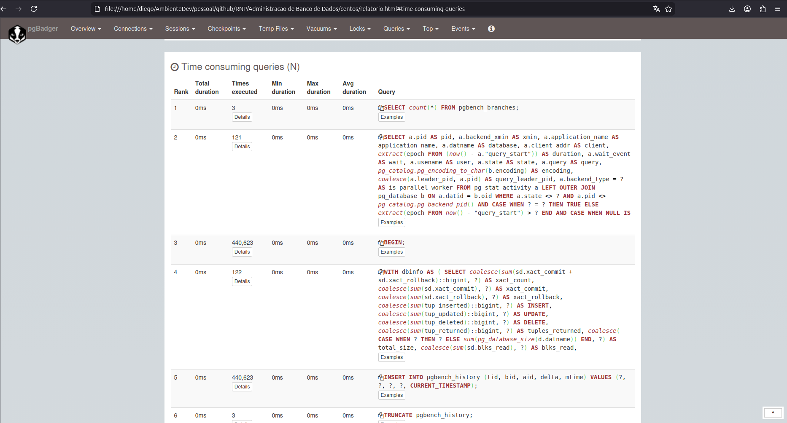

<table style="width:100%; border-collapse: collapse;">
  <tr>
    <td style="width: 120px;">
      
    </td>
    <td style="vertical-align: middle; text-align: left;">
      <h1 style="margin: 0; color: #0f308dff;">Administração de Bancos de Dados</h1>
    </td>
  </tr>
</table>

<p style="margin: 4px 0 0 0; font-size: 14px; color: #333;">Aluno: <strong>Diego Vitor Soares dos Santos</strong></p>
<p style="margin: 4px 0 0 0; font-size: 14px; color: #333;">Cod. Turma: <strong>DES11</strong></p>
<p style="margin: 4px 0 0 0; font-size: 14px; color: #333;">Data: <strong>13 de dezembro de 2025</strong></p>

# **Módulo 5 – Monitoramento do Ambiente**

## ⚙️ **Ambiente de Teste**

* **Virtualização:** Vagrant + VirtualBox
* **Sistema Operacional:** CentOS Stream 9 (Kernel 5.x)
* **PostgreSQL:** 17.2 (estável)
* **Diretório de dados:** `/db/data/`
* **Diretório de logs:** `/db/data/log/`

---

## Atividade 5.a – Popular base de dados

**Objetivo:** Criar uma base de testes usando pgbench.

**Passos:**

1. **Instalar pgbench:**
   - Acesse: `contrib/pgbench/` no diretório dos fontes do PostgreSQL
   - Compile e instale (use `sudo` se necessário)
   - Não requer `CREATE EXTENSION`

2. **Criar base:** `pgbench`

3. **Popular a base:**
   ```bash
   pgbench -i -s 100 pgbench
   ```

### **Comandos Executados**

```bash
# script de instalação do pgbench ``ìnstall_pgbensh.sh```

# verificar o diretório de instalação do pgbench
which pgbench

# Criar base de dados
createdb pgbench

# Popular a base com fator de escala 100
pgbench -i -s 100 pgbench
```

### **Resultado da Execução**

```bash
[postgres@vm02 ~]$ which pgbench
/usr/local/pgsql/bin/pgbench
[postgres@vm02 ~]$ createdb pgbench
[postgres@vm02 ~]$ pgbench -i -s 100 pgbench
dropping old tables...
NOTICE:  table "pgbench_accounts" does not exist, skipping
NOTICE:  table "pgbench_branches" does not exist, skipping
NOTICE:  table "pgbench_history" does not exist, skipping
NOTICE:  table "pgbench_tellers" does not exist, skipping
creating tables...
generating data (client-side)...
vacuuming...                                                                                  
creating primary keys...
done in 15.28 s (drop tables 0.00 s, create tables 0.00 s, client-side generate 8.96 s, vacuum 1.42 s, primary keys 4.90 s).
[postgres@vm02 ~]$
```
---

## Atividade 5.b - Configuração de Log

**Objetivo:** Configurar log para geração de relatórios.

**Passos:**

1. **Habilitar coletor de log:**
   ```
   logging_collector = on
   ```

2. **Definir prefixo do log:**
   ```
   log_line_prefix = '%t [%p]: [%l-1] user=%u,db=%d '
   ```

3. **Registrar todas as queries:**
   ```
   log_statement = 'all'
   ```

4. **Recarregar configurações:**
   ```bash
   pg_ctl reload
   ```
   ou
   ```sql
   SELECT pg_reload_conf();
   ```

### **Comandos Executados**

```bash
# Habilitar o coletor de **log**
sed -i "s/^#logging_collector = .*/logging_collector = on/" /db/data/postgresql.conf

# Definir prefixo do log
sed -i "s|^#log_line_prefix = .*|log_line_prefix = '%t [%p]: [%l-1] user=%u,db=%d '|" /db/data/postgresql.conf

# Registrar todas as queries
sed -i "s/^#log_statement = .*/log_statement = 'all'/" /db/data/postgresql.conf

# ver o resultado dos comandos acima
egrep "^(logging_collector|log_line_prefix|log_statement)" /db/data/postgresql.conf


pg_ctl -D /db/data reload
```

### **Resultado da Execução**

```bash
[postgres@vm02 ~]$ sed -i "s/^#logging_collector = .*/logging_collector = on/" /db/data/postgresql.conf
[postgres@vm02 ~]$ sed -i "s|^#log_line_prefix = .*|log_line_prefix = '%t [%p]: [%l-1] user=%u,db=%d '|" /db/data/postgresql.conf
[postgres@vm02 ~]$ sed -i "s/^#log_statement = .*/log_statement = 'all'/" /db/data/postgresql.conf
[postgres@vm02 ~]$ egrep "^(logging_collector|log_line_prefix|log_statement)" /db/data/postgresql.conf
logging_collector = on
log_line_prefix = '%t [%p]: [%l-1] user=%u,db=%d '
log_statement = 'all'
[postgres@vm02 ~]$ pg_ctl -D /db/data reload
server signaled
[postgres@vm02 ~]$

```

---

## Atividade 5.c – Análise de carga

**Objetivo:** Analisar carga do sistema com vmstat durante execução do pgbench.

**Passos:**

1. **Terminal 1 - Monitorar sistema:**
   ```bash
   vmstat 1
   ```

2. **Terminal 2 - Executar teste (60 segundos):**
   ```bash
   pgbench -c 5 -T 60 pgbench
   ```

**Análise:**

Observe no vmstat:
- **procs:** Quantidade de processos em execução/aguardando
- **memory (free):** Memória livre disponível
- **memory (cache):** Cache de disco
- **io (bi):** Blocos lidos do disco (input)
- **io (bo):** Blocos escritos no disco (output)


### **Comandos Executados**

**Terminal 1 - Monitoramento:**
```bash
vmstat 1
```

**Terminal 2 - Carga:**
```bash
pgbench -c 5 -T 60 pgbench
```

### **Resultado da Execução**



> 💡 Utilizei um intervalo de 5 segundos entre amostras para facilitar a visualização no print.


## Análise do Benchmark PostgreSQL

| **Categoria** | **Métrica** | **Valor** | **Status** | **Observação** |
|---------------|-------------|-----------|------------|----------------|
| **pgbench** | TPS | 1.714 | ✅ | Performance boa |
| | Latência | 2.9 ms | ✅ | Sem falhas |
| **PROCS** | r (running) | 0-8 | ⚠️ | Contenção de CPU - mais processos que CPUs |
| | b (blocked) | 0-3 | ⚠️ | Processos aguardando I/O de escrita |
| **MEMORY (free)** | Antes | 84 MB | ✅ | Sempre disponível |
| | Durante | 84-115 MB | ✅ | Sem swap |
| | Após | 94 MB | ✅ | Sistema saudável |
| **MEMORY (cache)** | Baseline | 1.490 MB (1.45 GB) | ✅ | Cache alto e estável |
| | Durante | 1.459-1.490 MB | ✅ | Variação de 3% |
| | Queda máxima | 31 MB | ✅ | No pico de I/O |
| **IO - bi (leitura)** | Idle | 0-92 blocos/s | - | Antes do teste |
| | Durante | 13.000-19.000 blocos/s | ⚠️ | ~13-19 MB/s |
| | Pico | 19.094 blocos/s | ⚠️ | I/O intenso |
| **IO - bo (escrita)** | Durante | 17.000-52.000 blocos/s | ⚠️ | ~17-52 MB/s |
| | Pico | 52.248 blocos/s | ⚠️ | TPC-B = muitos UPDATEs |


---

## Atividade 5.d – Análise de uso de disco

**Objetivo:** Analisar uso do disco com iostat durante operação no banco.

**Passos:**

1. **Terminal 1 - Monitorar disco:**
   ```bash
   iostat -m -x 2
   ```

2. **Terminal 2 - Executar query:**
   ```bash
   psql -d pgbench
   ```
   ```sql
   CREATE TEMP TABLE teste AS 
   SELECT a.* 
   FROM pgbench_accounts a 
   JOIN pgbench_tellers t ON a.bid=t.bid;
   ```

**Análise:**

Observe no iostat:
- **%iowait:** Percentual de tempo da CPU aguardando I/O
- **%util:** Percentual de utilização do disco
- **rMB/s:** Taxa de leitura em MB por segundo
- **wMB/s:** Taxa de escrita em MB por segundo

### **Comandos Executados**

**Terminal 1 - Monitoramento:**
```bash
iostat -m -x 2
```

**Terminal 2 - Operação:**
```sql
psql -d pgbench

CREATE TEMP TABLE teste AS 
SELECT a.* 
FROM pgbench_accounts a 
JOIN pgbench_tellers t ON a.bid=t.bid;
```

### **Resultado da Execução**

```bash
# Terminal 1
[postgres@vm02 ~]$ iostat -m -x 6
Linux 5.14.0-642.el9.x86_64 (vm02) 	12/13/2025 	_x86_64_	(2 CPU)

avg-cpu:  %user   %nice %system %iowait  %steal   %idle
           0.31    0.01    0.52    0.08    0.00   99.09

Device            r/s     rMB/s   rrqm/s  %rrqm r_await rareq-sz     w/s     wMB/s   wrqm/s  %wrqm w_await wareq-sz     d/s     dMB/s   drqm/s  %drqm d_await dareq-sz     f/s f_await  aqu-sz  %util
sda             14.70      0.20     0.15   1.00    0.19    13.84   35.27      0.65     0.72   2.00    0.13    18.86    0.00      0.00     0.00   0.00    0.00     0.00    8.79    0.10    0.01   0.55


avg-cpu:  %user   %nice %system %iowait  %steal   %idle
          19.41    0.00   19.33   12.77    0.00   48.49

Device            r/s     rMB/s   rrqm/s  %rrqm r_await rareq-sz     w/s     wMB/s   wrqm/s  %wrqm w_await wareq-sz     d/s     dMB/s   drqm/s  %drqm d_await dareq-sz     f/s f_await  aqu-sz  %util
sda            479.33     11.98     8.33   1.71    0.29    25.59 1359.33    162.91     6.83   0.50    0.22   122.72    0.00      0.00     0.00   0.00    0.00     0.00    3.50    0.05    0.44  33.20


avg-cpu:  %user   %nice %system %iowait  %steal   %idle
          26.48    0.00   31.33   23.43    0.00   18.76

Device            r/s     rMB/s   rrqm/s  %rrqm r_await rareq-sz     w/s     wMB/s   wrqm/s  %wrqm w_await wareq-sz     d/s     dMB/s   drqm/s  %drqm d_await dareq-sz     f/s f_await  aqu-sz  %util
sda            658.67     16.95    13.50   2.01    0.42    26.35 2350.67    264.19     8.67   0.37    0.22   115.09    0.00      0.00     0.00   0.00    0.00     0.00    5.17    0.13    0.79  61.92


avg-cpu:  %user   %nice %system %iowait  %steal   %idle
           1.68    0.00    3.52    1.59    0.00   93.22

Device            r/s     rMB/s   rrqm/s  %rrqm r_await rareq-sz     w/s     wMB/s   wrqm/s  %wrqm w_await wareq-sz     d/s     dMB/s   drqm/s  %drqm d_await dareq-sz     f/s f_await  aqu-sz  %util
sda             40.33      0.98     1.00   2.42    0.40    24.96  176.17     18.69    13.33   7.04    0.23   108.64    0.00      0.00     0.00   0.00    0.00     0.00    1.33    0.00    0.06   3.97

```

```bash
# Terminal 2
[postgres@vm02 ~]$ psql -d pgbench
psql (17.2)
Type "help" for help.

pgbench=# CREATE TEMP TABLE teste AS 
   SELECT a.* 
   FROM pgbench_accounts a 
   JOIN pgbench_tellers t ON a.bid=t.bid;
ERROR:  could not extend file "base/16475/t10_16519.2" with FileFallocate(): No space left on device
HINT:  Check free disk space.
```


### **Intervalos 3-4: Durante o Benchmark (CRÍTICO)**

| **Métrica** | **Valor** | **Status** | **Interpretação** |
|-------------|-----------|------------|-------------------|
| **CPU user** | 28% | ⚠️ | PostgreSQL processando |
| **CPU system** | 31-32% | 🚨 | Kernel sobrecarregado |
| **CPU iowait** | 20-27% | 🔴 | **AGUARDANDO DISCO!** |
| **CPU idle** | 14-20% | 🚨 | Sistema quase saturado |
| | | | |
| **r/s (leitura)** | 633-726 ops/s | ⚠️ | Leituras intensas |
| **rMB/s** | 16-17 MB/s | ⚠️ | Throughput de leitura |
| **w/s (escrita)** | 2.062-2.459 ops/s | 🔴 | **ESCRITAS MASSIVAS** |
| **wMB/s** | 237-253 MB/s | 🔴 | **DISCO SATURADO** |
| **%util** | 58-61% | 🚨 | Disco trabalhando pesado |
| **aqu-sz** | 0.71-0.85 | ⚠️ | Fila de I/O crescendo |

> 💡 O disco saturou antes da finalização do benchmark.

---

## Atividade 5.e – Acompanhamento de Processos

**Objetivo:** Monitorar processos do PostgreSQL com pg_activity durante execução do pgbench.

**Passos:**

1. **Terminal 1 - Monitorar processos:**
   ```bash
   pg_activity
   ```

2. **Terminal 2 - Executar teste (90 segundos):**
   ```bash
   pgbench -c 5 -T 90 pgbench
   ```

**Análise:**

Observe no pg_activity:
- **Estado dos processos:** Ativos, ociosos, aguardando
- **Processos bloqueados:** Pressione **F2** para visualizar
- **Processos bloqueando:** Pressione **F3** para visualizar
- **Espera por I/O:** Identifique processos em wait state
- **TPS:** Transações por segundo
- **IOPS:** Operações de I/O por segundo

### **Comandos Executados**

**Terminal 1 - Monitoramento:**
```bash
pg_activity -U postgres -d pgbench -h localhost -p 5432
```

**Terminal 2 - Carga:**
```bash
pgbench -c 5 -T 90 pgbench
```

### **Resultado da Execução**




###  **Análise no momento do print**

| Métrica             | Valor                     | Observação                          |
|---------------------|---------------------------|-------------------------------------|
| Sessões ativas      | 4                         | Alta atividade                      |
| Sessões idle        | 3                         | Sem transações em espera           |
| TPS                 | 1616                      | Alta taxa de transações             |
| IOPS leitura        | 1547/s                    | Moderada                            |
| IOPS escrita        | 4251/s                    | Alta carga de escrita               |

> Não foi mostrado no print, mas em alguns momentos houve querys em espera.
> Não foi possível observar querys bloqueadas.

---

## **f) Geração de Relatório com pgBadger**

## Atividade 5.f – Gerar relatório

**Objetivo:** Gerar relatório de queries com pgBadger.

**Passos:**

1. **Processar logs:**
   ```bash
   pgbadger -f stderr /db/data/log/*.log -o ~/relatorio.html
   ```

2. **Acessar relatório:**
   - Abra `~/relatorio.html` no browser
   - Se necessário, copie o arquivo para o host local

**Análise:**

Explore no relatório:
- **Time Consuming Queries:** Queries que consomem mais tempo
- Identifique gargalos e oportunidades de otimização

### **Comando Executado**

```bash
pgbadger -f stderr /db/data/log/*.log -o ~/relatorio.html
```

### **Resultado da Execução**

```bash
[postgres@vm02 ~]$ pgbadger -f stderr /db/data/log/*.log -o ~/relatorio.html
[>                        ] Parsed         0 bytes of 440206[>                        ] Parsed      1180 bytes of 440206[>                        ] Parsed      2385 bytes of 440206[>                        ] Parsed      2385 bytes of 440206[>                        ] Parsed      3661 bytes of 440206[>                        ] Parsed     16457 bytes of 440206[>                        ] Parsed    141976 bytes of 440206[>                        ] Parsed   1407616 bytes of 440206[>                        ] Parsed   2818237 bytes of 440206[>                        ] Parsed   4228822 bytes of 440206[>                        ] Parsed   5639361 bytes of 440206[>                        ] Parsed   7050270 bytes of 440206[>                        ] Parsed   8470411 bytes of 440206[>                        ] Parsed   9890999 bytes of 440206[>                        ] Parsed  10488159 bytes of 440206[>                        ] Parsed  10488159 bytes of 440206[>                        ] Parsed  10489580 bytes of 440206[>                        ] Parsed  10502250 bytes of 440206[>                        ] Parsed  10630143 bytes of 440206[>                        ] Parsed  11908710 bytes of 440206[>                        ] Parsed  13329401 bytes of 440206[>                        ] Parsed  14749699 bytes of 440206[>                        ] Parsed  16170241 bytes of 440206[>                        ] Parsed  17590571 byt[========================>] Parsed 440206779 bytes of 440206779 (100.00%), queries: 3084869, events: 5events: 3
LOG: Ok, generating html report...
[postgres@vm02 ~]$
```




---

## Atividade 5.g – Consultar tamanho da tabela

**Objetivo:** Consultar o tamanho da tabela pgbench_accounts e seus índices.

**Query:**

```sql
-- Tamanho da tabela
SELECT pg_size_pretty(pg_table_size('pgbench_accounts')) AS tamanho_tabela;

-- Tamanho dos índices
SELECT pg_size_pretty(pg_indexes_size('pgbench_accounts')) AS tamanho_indices;

-- Tamanho total (tabela + índices)
SELECT pg_size_pretty(pg_total_relation_size('pgbench_accounts')) AS tamanho_total;
```

### **Resultado da Execução**

```bash
pgbench=# SELECT pg_size_pretty(pg_table_size('pgbench_accounts')) AS tamanho_tabela;
 tamanho_tabela 
----------------
 1303 MB
(1 row)

pgbench=# SELECT pg_size_pretty(pg_indexes_size('pgbench_accounts')) AS tamanho_indices;
 tamanho_indices 
-----------------
 214 MB
(1 row)

pgbench=# SELECT pg_size_pretty(pg_total_relation_size('pgbench_accounts')) AS tamanho_total;
 tamanho_total 
---------------
 1517 MB
(1 row)

pgbench=# 
```

## 📂 Projetos

- [Repositório Github Admin Banco de Dados DES11](https://github.com/diegovitorav/admin-banco-dados-des11): Repositório contendo todos os scripts SQL, configurações, exercícios práticos e atividades desenvolvidas durante o curso de Administração de Banco de Dados (DES11), abordando tópicos como gerenciamento de usuários, roles, permissões, segurança e otimização de banco de dados PostgreSQL.

## Referências (Material do Curso)

* ESCOLA SUPERIOR DE REDES (RNP). **Administração de Banco de Dados DES11: Capítulo 5 - Monitoramento do Ambiente**. Material do curso DES11. (Arquivo: `DES11-Mod05-v02_24.pdf`).

* Hans-Jürgen Schönig (Packt). **Mastering PostgreSQL 17**. Elevate your database skills with advanced deployment, optimization, and security strategies (6th Edition).