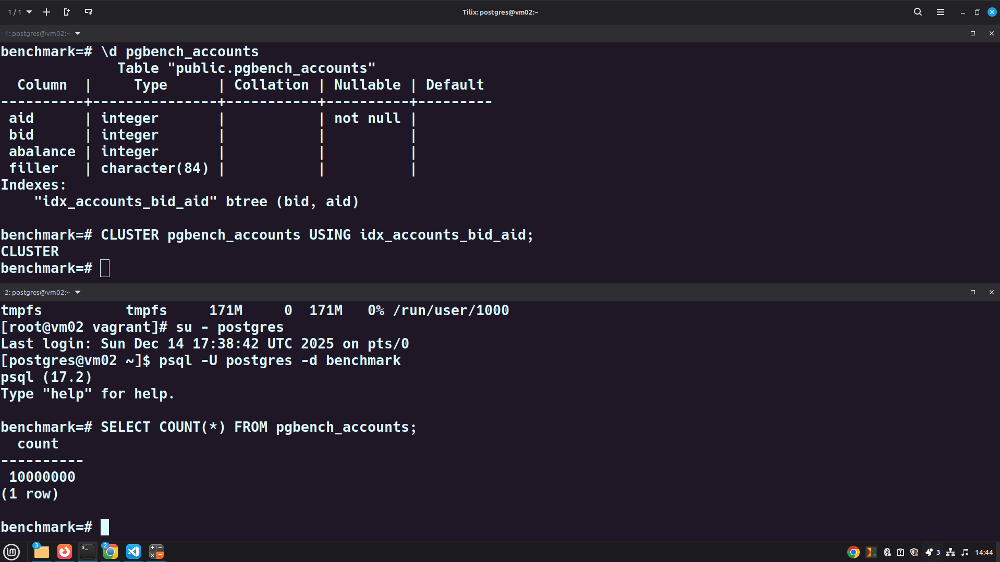

<table style="width:100%; border-collapse: collapse;">
  <tr>
    <td style="width: 120px;">
      
    </td>
    <td style="vertical-align: middle; text-align: left;">
      <h1 style="margin: 0; color: #0f308dff;">Administração de Bancos de Dados</h1>
    </td>
  </tr>
</table>

<p style="margin: 4px 0 0 0; font-size: 14px; color: #333;">Aluno: <strong>Diego Vitor Soares dos Santos</strong></p>
<p style="margin: 4px 0 0 0; font-size: 14px; color: #333;">Cod. Turma: <strong>DES11</strong></p>
<p style="margin: 4px 0 0 0; font-size: 14px; color: #333;">Data: <strong>14 de dezembro de 2025</strong></p>

# **Módulo 6 – Manutenção do Banco de Dados**

## Atividade 6.a – Alterar parâmetros do Autovacuum

**Objetivo:**

Editar o arquivo de configurações e alterar os parâmetros para fornecerem o seguinte comportamento:

- Ter apenas 1 Worker;
- Autovacuum esperar por 50ms quando atingir o limite de custo;
- Autovacuum trabalhar até um custo 10.

Verificar se as alterações exigem restart ou apenas reload.

### **Comandos Executados**

```bash
# Exibe o caminho do arquivo de configuração do PostgreSQL
SHOW config_file;

# Ajusta parâmetros do autovacuum no postgresql.conf
sed -i \
  -e 's/^[#]*\s*autovacuum_max_workers\s*=.*/autovacuum_max_workers = 1/' \
  -e 's/^[#]*\s*autovacuum_vacuum_cost_delay\s*=.*/autovacuum_vacuum_cost_delay = 50ms/' \
  -e 's/^[#]*\s*autovacuum_vacuum_cost_limit\s*=.*/autovacuum_vacuum_cost_limit = 10/' \
  /db/data/postgresql.conf

# Verifica os valores atuais dos parâmetros que serão alterados
SELECT name, setting, context 
FROM pg_settings 
WHERE name IN (
    'autovacuum_max_workers',
    'autovacuum_vacuum_cost_delay',
    'autovacuum_vacuum_cost_limit'
);

# Recarrega a configuração do PostgreSQL sem reiniciar o serviço
SELECT pg_reload_conf();

# Verifica o status do serviço PostgreSQL 17
systemctl status postgresql-17
```

### Resultado gerado no terminal


```bash
postgres=# SELECT name, setting, context 
FROM pg_settings 
WHERE name IN (
    'autovacuum_max_workers',
    'autovacuum_vacuum_cost_delay',
    'autovacuum_vacuum_cost_limit'
);
             name             | setting |  context   
------------------------------+---------+------------
 autovacuum_max_workers       | 3       | postmaster
 autovacuum_vacuum_cost_delay | 2       | sighup
 autovacuum_vacuum_cost_limit | -1      | sighup
(3 rows)

postgres=# SHOW config_file;
       config_file        
--------------------------
 /db/data/postgresql.conf
(1 row)

postgres=# exit
[postgres@vm02 ~]$ egrep '^(#?\s*autovacuum_max_workers|#?\s*autovacuum_vacuum_cost_delay|#?\s*autovacuum_vacuum_cost_limit)' /db/data/postgresql.conf
#autovacuum_max_workers = 3		# max number of autovacuum subprocesses
#autovacuum_vacuum_cost_delay = 2ms	# default vacuum cost delay for
#autovacuum_vacuum_cost_limit = -1	# default vacuum cost limit for
[postgres@vm02 ~]$ sed -i \
  -e 's/^[#]*\s*autovacuum_max_workers\s*=.*/autovacuum_max_workers = 1/' \
  -e 's/^[#]*\s*autovacuum_vacuum_cost_delay\s*=.*/autovacuum_vacuum_cost_delay = 50ms/' \
  -e 's/^[#]*\s*autovacuum_vacuum_cost_limit\s*=.*/autovacuum_vacuum_cost_limit = 10/' \
  /db/data/postgresql.conf
[postgres@vm02 ~]$ egrep '^(#?\s*autovacuum_max_workers|#?\s*autovacuum_vacuum_cost_delay|#?\s*autovacuum_vacuum_cost_limit)' /db/data/postgresql.conf
autovacuum_max_workers = 1
autovacuum_vacuum_cost_delay = 50ms
autovacuum_vacuum_cost_limit = 10
[postgres@vm02 ~]$ psql
psql (17.2)
Type "help" for help.

postgres=# SELECT pg_reload_conf();
 pg_reload_conf 
----------------
 t
(1 row)

postgres=# SELECT name, setting, context 
FROM pg_settings 
WHERE name IN (
    'autovacuum_max_workers',
    'autovacuum_vacuum_cost_delay',
    'autovacuum_vacuum_cost_limit'
);
             name             | setting |  context   
------------------------------+---------+------------
 autovacuum_max_workers       | 3       | postmaster
 autovacuum_vacuum_cost_delay | 50      | sighup
 autovacuum_vacuum_cost_limit | 10      | sighup
(3 rows)
```

### Situação inicial (antes da alteração)
Consulta ao `pg_settings` mostrou:
- **autovacuum_max_workers** = **3**  
  - Contexto: `postmaster` → só pode ser alterado reiniciando o servidor.  
- **autovacuum_vacuum_cost_delay** = **2 ms**  
  - Contexto: `sighup` → pode ser alterado com `pg_reload_conf()`.  
- **autovacuum_vacuum_cost_limit** = **-1**  
  - `-1` significa ilimitado.  
  - Contexto: `sighup`.

Arquivo `postgresql.conf` tinha os parâmetros comentados com valores padrão:
```conf
#autovacuum_max_workers = 3
#autovacuum_vacuum_cost_delay = 2ms
#autovacuum_vacuum_cost_limit = -1
```

### Alteração feita
Com `sed`, os parâmetros foram descomentados e ajustados:
```conf
autovacuum_max_workers = 1
autovacuum_vacuum_cost_delay = 50ms
autovacuum_vacuum_cost_limit = 10
```

Depois foi executado:
```sql
SELECT pg_reload_conf();
```
que recarregou as configurações sem reiniciar o servidor.

###  Situação logo após alteração
A nova consulta ao `pg_settings` mostrou:
- **autovacuum_max_workers** = **3** (não mudou)  
  - Motivo: parâmetro é `postmaster` e  define **quantos processos workers serão criados** quando o PostgreSQL inicia. Precisa **reiniciar o PostgreSQL** para que a alteração seja aplicada.  
- **autovacuum_vacuum_cost_delay** = **50 ms** (mudou com sucesso)  
  - Alteração aplicada via `pg_reload_conf()`.  
- **autovacuum_vacuum_cost_limit** = **10** (mudou com sucesso)  
  - Também aplicado via reload.


### Resultado após o reinicio do serviço ```postgresql-17```

```bash
[root@vm02 vagrant]# sudo systemctl restart postgresql-17.service
[root@vm02 vagrant]# su - postgres
Last login: Sun Dec 14 14:10:33 UTC 2025 on pts/0
[postgres@vm02 ~]$ psql
psql (17.2)
Type "help" for help.

postgres=# SELECT name, setting, unit 
FROM pg_settings 
WHERE name LIKE 'autovacuum%cost%' 
   OR name = 'autovacuum_max_workers';
             name             | setting | unit 
------------------------------+---------+------
 autovacuum_max_workers       | 1       | 
 autovacuum_vacuum_cost_delay | 50      | ms
 autovacuum_vacuum_cost_limit | 10      | 
(3 rows)
```

###  Conclusão
- **Mudanças aplicadas imediatamente:**  
  - `autovacuum_vacuum_cost_delay` → de 2ms para 50ms  
  - `autovacuum_vacuum_cost_limit` → de ilimitado (-1) para 10  

- **Mudança pendente de reinício:**  
  - `autovacuum_max_workers` → de 3 para 1. Aplicado somente após o reinicio do serviço ```postgresql-17```.  


---

## Atividade 6.b – Monitorar o Autovacuum

**Objetivo:**

Monitorar a execução do Autovacuum durante operações de carga no banco de dados.

**Passos:**

1. Criar uma nova base chamada benchmark (remover a anterior se necessário);

2. Popular a base com o pgbench:
   ```
   pgbench -i -s 10 benchmark
   ```

3. Criar a função para gerar strings aleatórias para popular a base:
   ```
   psql -d benchmark < /curso/scripts/random_string.sql
   ```

4. Executar o script do pgbench disponível em "/curso/scripts/atualizacao.sql":
   ```
   pgbench -c 10 -T 60 -n -f /curso/scripts/atualizacao.sql benchmark
   ```

5. Verificar com o pg_activity se há execuções do Autovacuum durante ou após os testes.

## Passos a passo

1. **Apagar e recriar o banco de dados de benchmark**
   ```bash
   psql -U postgres -c "DROP DATABASE IF EXISTS benchmark;"
   psql -U postgres -c "CREATE DATABASE benchmark;"
   ```

2. **Inicializar o banco com tabelas padrão do pgbench**
   ```bash
   pgbench -i -s 10 benchmark
   ```
   Isso cria as tabelas `pgbench_accounts`, `pgbench_branches`, `pgbench_tellers` e `pgbench_history`.

3. **Verificar se as tabelas foram criadas**
   ```bash
   psql -d benchmark -c "\dt"
   ```
   será listados as seguintes tabelas:
    ```bash
    [postgres@vm02 ~]$ psql -d benchmark -c "\dt"
                List of relations
    Schema |       Name       | Type  |  Owner   
    --------+------------------+-------+----------
    public | pgbench_accounts | table | postgres
    public | pgbench_branches | table | postgres
    public | pgbench_history  | table | postgres
    public | pgbench_tellers  | table | postgres
    (4 rows)
    ```

4. **Carregar a função `random_string` no banco**
    ```bash
    psql -d benchmark << 'EOF'
    CREATE OR REPLACE FUNCTION public.random_string(length integer)
    RETURNS text
    LANGUAGE plpgsql
    AS $$
    DECLARE
    chars text[] := '{0,1,2,3,4,5,6,7,8,9,A,B,C,D,E,F,G,H,I,J,K,L,M,N,O,P,Q,R,S,T,U,V,W,X,Y,Z,a,b,c,d,e,f,g,h,i,j,k,l,m,n,o,p,q,r,s,t,u,v,w,x,y,z}';
    result text := '';
    i integer := 0;
    BEGIN
    IF length < 0 THEN
        RAISE EXCEPTION 'O comprimento não pode ser menor que 0';
    END IF;
    FOR i IN 1..length LOOP
        result := result || chars[1+random()*(array_length(chars, 1)-1)];
    END LOOP;
    RETURN result;
    END;
    $$;
    EOF
    ```

5. **Criar o arquivo de script de atualização (`atualizacao.sql`)**
   ```bash
   cat <<EOF > atualizacao.sql
   \set aid random(1, 100000 * :scale)
   UPDATE pgbench_accounts SET filler = random_string(60) WHERE aid = :aid;
   EOF
   ```

6. **Executar o teste de carga com pgbench**
   ```bash
   pgbench -c 10 -T 60 -n -f atualizacao.sql benchmark
   ```
7. **Monitorar em um segundo terminal o pg_activity**
Executar o seguinte comando em um segundo terminal para monitorrar o benchmark.
```bash
pg_activity -U postgres -d pgbench -h localhost -p 5432
```

### Resultado gerado no terminal


Na seção **“Other processes & info”** destacada pelo retangulo amarelo, aparece:

```
autovacuum workers: 1/1
```
Isso significa que:
- O PostgreSQL está configurado para permitir **1 processo de autovacuum simultâneo**.
- E **esse único processo está ativo no momento da captura** — ou seja, o autovacuum está rodando.

---

## Atividade 6.c – Vacuum com estatísticas

**Objetivo:**

Executar Vacuum com saída detalhada e analisar as diferenças entre tabelas.

**Passos:**

1. Conectar na base benchmark;

2. Consultar os dados de dead tuples no catálogo pg_stat_user_tables;

3. Executar um Vacuum com saída detalhada e atualização estatística na tabela pgbench_history;

4. Executar o mesmo procedimento para a tabela pgbench_account;

5. Analisar se houve diferenças na saída e identificar o motivo.


## Passo a passo

### Conexão na base benchmark
```bash
psql -d benchmark
```

### Comandos executados antes e após o VACUUM
```sql
-- Antes
SELECT relname, n_dead_tup, n_live_tup
FROM pg_stat_user_tables
WHERE relname IN ('pgbench_history', 'pgbench_accounts');

VACUUM (VERBOSE, ANALYZE) public.pgbench_history;
VACUUM (VERBOSE, ANALYZE) public.pgbench_accounts;

-- Depois
SELECT relname, n_dead_tup, n_live_tup, last_vacuum, last_analyze
FROM pg_stat_user_tables
WHERE relname IN ('pgbench_history', 'pgbench_accounts');
```

---

### Resultado do teste

```bash
benchmark=# SELECT relname, n_dead_tup, n_live_tup
FROM pg_stat_user_tables
WHERE relname IN ('pgbench_history', 'pgbench_accounts');
     relname      | n_dead_tup | n_live_tup 
------------------+------------+------------
 pgbench_history  |          0 |          0
 pgbench_accounts |     151867 |    1000000
(2 rows)

benchmark=# VACUUM (VERBOSE, ANALYZE) public.pgbench_history;
INFO:  vacuuming "benchmark.public.pgbench_history"
INFO:  finished vacuuming "benchmark.public.pgbench_history": index scans: 0
pages: 0 removed, 0 remain, 0 scanned (100.00% of total)
tuples: 0 removed, 0 remain, 0 are dead but not yet removable
removable cutoff: 4627904, which was 0 XIDs old when operation ended
new relfrozenxid: 4627904, which is 2492747 XIDs ahead of previous value
frozen: 0 pages from table (100.00% of total) had 0 tuples frozen
index scan not needed: 0 pages from table (100.00% of total) had 0 dead item identifiers removed
avg read rate: 0.000 MB/s, avg write rate: 0.000 MB/s
buffer usage: 6 hits, 0 misses, 0 dirtied
WAL usage: 1 records, 0 full page images, 188 bytes
system usage: CPU: user: 0.00 s, system: 0.00 s, elapsed: 0.00 s
INFO:  analyzing "public.pgbench_history"
INFO:  "pgbench_history": scanned 0 of 0 pages, containing 0 live rows and 0 dead rows; 0 rows in sample, 0 estimated total rows
VACUUM
benchmark=# VACUUM (VERBOSE, ANALYZE) public.pgbench_accounts;
INFO:  vacuuming "benchmark.public.pgbench_accounts"
INFO:  finished vacuuming "benchmark.public.pgbench_accounts": index scans: 0
pages: 0 removed, 29844 remain, 13021 scanned (43.63% of total)
tuples: 151796 removed, 663738 remain, 0 are dead but not yet removable
removable cutoff: 4627904, which was 0 XIDs old when operation ended
new relfrozenxid: 3780052, which is 1176453 XIDs ahead of previous value
frozen: 8391 pages from table (28.12% of total) had 94670 tuples frozen
index scan bypassed: 68 pages from table (0.23% of total) have 71 dead item identifiers
avg read rate: 16.872 MB/s, avg write rate: 826.596 MB/s
buffer usage: 25866 hits, 138 misses, 6761 dirtied
WAL usage: 16931 records, 8398 full page images, 16321939 bytes
system usage: CPU: user: 0.04 s, system: 0.01 s, elapsed: 0.06 s
INFO:  analyzing "public.pgbench_accounts"
INFO:  "pgbench_accounts": scanned 29844 of 29844 pages, containing 1000000 live rows and 71 dead rows; 30000 rows in sample, 1000000 estimated total rows
VACUUM
benchmark=# SELECT relname, n_dead_tup, n_live_tup, last_vacuum, last_analyze
FROM pg_stat_user_tables
WHERE relname IN ('pgbench_history', 'pgbench_accounts');
     relname      | n_dead_tup | n_live_tup |          last_vacuum          |         last_analyze          
------------------+------------+------------+-------------------------------+-------------------------------
 pgbench_history  |          0 |          0 | 2025-12-14 16:45:25.342139+00 | 2025-12-14 16:45:25.343297+00
 pgbench_accounts |         71 |    1000000 | 2025-12-14 16:45:32.344366+00 | 2025-12-14 16:45:32.459453+00
(2 rows)
```

### Análise Técnica do VACUUM

### Tabela Comparativa

| Métrica | pgbench_accounts (Antes) | pgbench_accounts (Depois) | Diferença |
|---------|--------------------------|---------------------------|-----------|
| **n_dead_tup** | 151.867 | 71 | -151.796 (-99,95%) |
| **n_live_tup** | 1.000.000 | 1.000.000 | 0 |
| **last_vacuum** | NULL | 2025-12-14 16:45:32 | ✓ Executado |
| **last_analyze** | NULL | 2025-12-14 16:45:32 | ✓ Executado |

### Análise dos Resultados

### 1. **pgbench_history**
- **Antes do VACUUM:**  
  - `n_dead_tup = 0`  
  - `n_live_tup = 0`  
- **Durante o VACUUM:**  
  - O relatório mostra que não havia páginas nem tuplas para limpar.  
  - Isso confirma que a tabela está **vazia** (nenhum dado foi inserido).  
- **Depois:**  
  - Continua com `0` tuplas vivas e mortas.  
  - O `last_vacuum` e `last_analyze` foram atualizados, mas não houve efeito prático.

### 2. **pgbench_accounts**
- **Antes do VACUUM:**  
  - `n_dead_tup = 151867`  
  - `n_live_tup = 1000000`  
  - Isso mostra que havia ~15% de tuplas mortas devido às atualizações feitas pelo seu script `atualizacao.sql`.
- **Durante o VACUUM:**  
  - Foram removidas **151796 tuplas mortas**.  
  - Restaram apenas **71 tuplas mortas** (provavelmente não removíveis ainda por estarem visíveis em transações ativas).  
  - Estatísticas foram atualizadas (`ANALYZE`), congelando páginas e ajustando o `relfrozenxid`.  
  - Houve uso de I/O e WAL, indicando trabalho real de manutenção.
- **Depois:**  
  - `n_dead_tup` caiu de 151867 → **71**.  
  - `n_live_tup` manteve-se em 1.000.000.  
  - `last_vacuum` e `last_analyze` registraram o momento da operação.

**Conclusão:** 
- **pgbench_history:** não tinha dados, logo o VACUUM não fez nada além de atualizar metadados.  
- **pgbench_accounts:** estava cheia de updates, acumulou muitas tuplas mortas, e o VACUUM foi essencial para liberar espaço e atualizar estatísticas.  

---

## Atividade 6.d – Cluster de tabela

**Objetivo:**

Executar o comando CLUSTER em uma tabela e observar seu comportamento e impacto no sistema.

**Preparação:**

Abrir dois terminais para execução paralela das tarefas.

**Passos no Terminal 1:**

1. Apagar a base benchmark e criá-la novamente;

2. Popular a base com pgbench:
   ```
   pgbench -i -s 100 benchmark
   ```

3. Criar um índice nas colunas bid e aid da tabela pgbench_accounts;

4. Executar o cluster da tabela por esse novo índice;

5. Durante a execução do cluster, passar para os passos do Terminal 2.

**Passos no Terminal 2 (enquanto o cluster executa):**

1. Acessar a base benchmark e tentar executar um SELECT na tabela;

2. Consultar o consumo de recursos do processo, o IO Wait etc.;

3. Verificar o espaço em disco sendo consumido:
   ```
   du -h /db/data
   ```

### Apagar e recriar a base benchmark

```bash
# Apagar o banco se existir
dropdb -U postgres --if-exists benchmark

# Criar novamente
createdb -U postgres benchmark
```

### Popular a base com pgbench

```bash
# Popular com fator de escala 100 (isso criará ~10 milhões de registros)
pgbench -i -s 100 -U postgres benchmark

# Listar todas as tabelas do banco benchmark
psql -U postgres -d benchmark -c "\dt"
```
### Resultado gerado no Terminal
```bash
[postgres@vm02 ~]$ DROP DATABASE IF EXISTS benchmark;
-bash: DROP: command not found
[postgres@vm02 ~]$ dropdb -U postgres --if-exists benchmark
[postgres@vm02 ~]$ createdb -U postgres benchmark
[postgres@vm02 ~]$ psql -U postgres -d benchmark -c "\dt"
Did not find any relations.
[postgres@vm02 ~]$ pgbench -i -s 100 -U postgres benchmark
dropping old tables...
NOTICE:  table "pgbench_accounts" does not exist, skipping
NOTICE:  table "pgbench_branches" does not exist, skipping
NOTICE:  table "pgbench_history" does not exist, skipping
NOTICE:  table "pgbench_tellers" does not exist, skipping
creating tables...
generating data (client-side)...
vacuuming...                                                                                   
creating primary keys...
pgbench: error: query failed: ERROR:  could not write to file "base/pgsql_tmp/pgsql_tmp5092.0.fileset/1.0": No space left on device
CONTEXT:  parallel worker
pgbench: detail: Query was: alter table pgbench_accounts add primary key (aid)
[postgres@vm02 ~]$ psql -U postgres -d benchmark -c "\dt"
              List of relations
 Schema |       Name       | Type  |  Owner   
--------+------------------+-------+----------
 public | pgbench_accounts | table | postgres
 public | pgbench_branches | table | postgres
 public | pgbench_history  | table | postgres
 public | pgbench_tellers  | table | postgres
(4 rows)
```

### Criar índice nas colunas bid e aid

```bash
# Conectar à base benchmark
psql -U postgres -d benchmark

# Criar o índice composto
CREATE INDEX idx_accounts_bid_aid ON pgbench_accounts(bid, aid);

# Verificar o índice criado
\d pgbench_accounts
```

### Executar o CLUSTER

```bash
# Ainda no psql, executar o cluster
CLUSTER pgbench_accounts USING idx_accounts_bid_aid;

# Ver tamanho da tabela antes e depois
SELECT pg_size_pretty(pg_total_relation_size('pgbench_accounts'));
```


### **Terminal 2 - Monitoramento durante o CLUSTER**

### Tentar executar um SELECT na tabela

```bash
# Abrir nova conexão ao PostgreSQL
psql -U postgres -d benchmark

# Tentar executar um SELECT (você verá que ficará bloqueado)
SELECT COUNT(*) FROM pgbench_accounts;
```



**Observação Esperada:** O comando SELECT COUNT(*) no Terminal 2 permaneceu travado, pois a operação CLUSTER (no Terminal 1) obtém um nível de bloqueio chamado ACCESS EXCLUSIVE LOCK. Este é o tipo de bloqueio mais restritivo do PostgreSQL e é incompatível até mesmo com operações de leitura (SELECT), que tentam obtém o bloqueio mais leve (ACCESS SHARE LOCK). Portanto, o SELECT deve esperar que o CLUSTER termine e libere a tabela.

### 1. Análise do Espaço em Disco (`du -h /db/data`)

Ocorreu um aumento no consumo do disco que foi necessário aumentar o disco de 10GB para 20GB.


### 2. Análise do Desempenho do Sistema (`iostat -x 2`)

Os intervalos do `iostat` mostram claramente o perfil de recursos consumidos pela operação `CLUSTER`.

| Intervalo | %user | %system | **%iowait** | **%idle** | rkB/s (Leitura MB/s) | wkB/s (Escrita MB/s) | **%util** (sda) | **Fase do CLUSTER** |
| :---: | :---: | :---: | :---: | :---: | :---: | :---: | :---: | :--- |
| **1** | 1.31 | 2.54 | 1.35 | 94.80 | 13.6 MB/s | 11.4 MB/s | 3.70% | **Pré-CLUSTER / Inativo** (Baixa atividade normal) |
| **2** | 17.18 | 39.49 | **20.51** | 22.82 | 155 MB/s | **268 MB/s** | 54.80% | **Fase 1: Leitura e Escrita Mista** (Lendo a tabela antiga para ordenar e escrevendo a nova tabela/WAL) |
| **3** | 17.62 | 38.60 | **21.50** | 22.28 | 193 MB/s | **278 MB/s** | 59.65% | **Fase 2: Escrita Sustentada** (Ainda reescrevendo a tabela e gerando WAL) |
| **4** | **41.28** | **47.44** | 11.03 | 0.26 | **581 MB/s** | 77.3 MB/s | 62.85% | **Fase 3: Leitura e Ordenação Rápida** (Possívelmente lendo o buffer/cache ou a tabela temporária reordenada) |
| **5** | 32.98 | 26.44 | 13.87 | 26.70 | 48 MB/s | 217 MB/s | 35.50% | **Fase 4: Final de Escrita/WAL Flush** (Baixa leitura, alta escrita para finalizar a cópia e o WAL) |
| **6** | 17.60 | 51.28 | **14.29** | 16.84 | **634 MB/s** | 87.8 MB/s | **65.15%** | **Fase 5: Pico de I/O** (Alta leitura/escrita simultânea - pode ser a fase final de troca de arquivos e flush de cache) |
| **7** | 0.00 | 0.00 | 0.00 | **100.00** | 0.00 | 0.00 | 0.00% | **Pós-CLUSTER / Ocioso** (Operação finalizada) |

#### **Conclusões:**

1.  **I/O Bound, mas Não Saturado:** A operação é intensiva em I/O, gerando picos de vazão de $581\text{ MB/s}$ e $634\text{ MB/s}$ (Intervalos 4 e 6). No entanto, o sda não está saturado ( %util máximo de $65.15\%$) e as latências (r_await / w_await) permanecem baixíssimas (tipicamente abaixo de $0.3\text{ ms}$). O disco não é o gargalo.
2.  **CPU vs I/O Wait:** O processo consome uma quantidade significativa de CPU (pico de $41.28\% \text{ user} + 47.44\% \text{ system} = 88.72\%$ de uso total no Intervalo 4). Embora o `%iowait` chegue a $21.50\%$ (Intervalo 3), isso indica que o sistema está **principalmente ocupado** fazendo o trabalho de ordenação e cópia de dados (CPU Bound), e o I/O ocorre em alta velocidade, acompanhando a demanda da CPU.
3.  **Confirmação do Bloqueio:** Os dados do `iostat` confirmam que houve uma operação longa (cerca de 10-12 segundos entre o Intervalo 2 e 6) e pesada no Terminal 1. Isso **confirma** a sua **Observação Esperada**: o `SELECT` no Terminal 2 foi bloqueado durante toda essa atividade intensa, pois o `CLUSTER` manteve o `ACCESS EXCLUSIVE LOCK` na tabela durante todo o ciclo de reescrita. 

**Síntese:** A operação CLUSTER transformou o sistema de um estado de "esperando trabalho" (3.70%) para um estado de "trabalhando duro na cópia de dados" (65.15%), o que é o comportamento esperado para qualquer tarefa de reescrita de tabela em grande escala.

---

## **Atividade 6.e – Vacuum Full**

**Objetivo:**

Executar Vacuum Full e comparar seu comportamento com o comando CLUSTER.

**Passos:**

Executar o mesmo procedimento realizado na Atividade 6.d (CLUSTER) para o Vacuum Full na mesma tabela, observando o comportamento, travamento e consumo de recursos.

### **TERMINAL 1 - Execução do VACUUM FULL**

### Conectar à base benchmark

```bash
# Conectar à base
psql -U postgres -d benchmark
```

### Verificar estado atual da tabela (opcional)

```sql
-- Verificar tamanho e bloat da tabela antes do VACUUM FULL
SELECT 
    pg_size_pretty(pg_total_relation_size('pgbench_accounts')) as tamanho_total,
    pg_size_pretty(pg_relation_size('pgbench_accounts')) as tamanho_tabela;
```

### Resultado 
```bash
[postgres@vm02 ~]$ psql -U postgres -d benchmark
psql (17.2)
Type "help" for help.

benchmark=# SELECT 
    pg_size_pretty(pg_total_relation_size('pgbench_accounts')) as tamanho_total,
    pg_size_pretty(pg_relation_size('pgbench_accounts')) as tamanho_tabela;
 tamanho_total | tamanho_tabela 
---------------+----------------
 1495 MB       | 1281 MB
(1 row)
```

### Executar VACUUM FULL

```sql
-- Executar VACUUM FULL (isso vai reorganizar e compactar a tabela)
VACUUM FULL pgbench_accounts;
```

### **TERMINAL 2 - Monitoramento (executar DURANTE o VACUUM FULL)**

### Tentar acessar a tabela

```bash
# Abrir outro terminal e conectar à base
psql -U postgres -d benchmark

# Tentar fazer um SELECT (observe que ficará BLOQUEADO)
SELECT COUNT(*) FROM pgbench_accounts;

# Tentar um UPDATE (também ficará bloqueado)
UPDATE pgbench_accounts SET abalance = abalance + 1 WHERE aid = 1;
```

### Análise do VACUUM FULL

### **Análise do Desempenho do Sistema (`iostat -x 2`)**

Os intervalos do `iostat` revelam o perfil de consumo de recursos durante a operação `VACUUM FULL`.

| Intervalo | %user | %system | **%iowait** | **%idle** | rkB/s (Leitura) | wkB/s (Escrita) | **%util** (sda) | **Fase do VACUUM FULL** |
| :---: | :---: | :---: | :---: | :---: | :---: | :---: | :---: | :--- |
| **1** | 0.00 | 0.25 | 0.00 | 99.75 | 0 MB/s | 0 MB/s | 0.00% | **Baseline** (sistema ocioso) |
| **2** | 4.53 | 9.57 | 1.76 | 84.13 | 44 MB/s | 38 MB/s | 10.90% | **Início** (scan inicial da tabela) |
| **3** | 15.58 | 43.12 | **22.60** | 18.70 | 154 MB/s | **303 MB/s** | **62.65%** | **Reescrita Intensiva** (cópia + WAL) |
| **4** | 14.40 | 40.10 | **27.76** | 17.74 | 140 MB/s | **277 MB/s** | **67.60%** | **Pico de I/O Wait** (escrita sustentada) |
| **5** | 13.47 | 39.38 | **38.34** | 8.81 | 135 MB/s | **324 MB/s** | **74.85%** | **Máxima Utilização Disco** (flush WAL) |
| **6** | 14.18 | 35.57 | 21.65 | 28.61 | 143 MB/s | 238 MB/s | 60.35% | **Escrita Moderada** (compactação final) |
| **7** | 32.99 | 45.52 | 12.53 | 8.95 | **468 MB/s** | 134 MB/s | 62.25% | **Leitura Intensiva** (verificação/índices) |
| **8** | 38.64 | 35.51 | 12.79 | 13.05 | 247 MB/s | 194 MB/s | 48.10% | **I/O Balanceado** (reorganização final) |
| **9** | 19.89 | 33.24 | 25.61 | 21.25 | 303 MB/s | 121 MB/s | 51.20% | **Leitura para Validação** |
| **10** | 7.09 | 22.53 | 5.57 | 64.81 | **344 MB/s** | 0.1 MB/s | 26.70% | **Finalização** (leitura final, baixa escrita) |
| **11** | 0.00 | 0.25 | 0.00 | 99.75 | 0 MB/s | 0 MB/s | 0.00% | **Pós-VACUUM** (operação concluída) |
| **12** | 0.00 | 1.78 | 3.05 | 95.18 | 0 MB/s | 60 MB/s | 9.00% | **Checkpoint/fsync** (finalização WAL) |


### **Conclusões Técnicas**

### 1. **Operação I/O-Bound com Saturação Moderada**
- **Pico de utilização:** 74.85% (intervalo 5) com throughput de escrita de 324 MB/s
- **I/O Wait máximo:** 38.34% (intervalo 5), indicando gargalo temporário em I/O
- **Latências:** Consistentemente abaixo de 0.41ms (r_await/w_await), indicando storage responsivo apesar da carga

### 2. **Perfil de Carga: Escrita-Dominante com Picos de Leitura**
- **Fase 3-6 (intervalos 3-6):** Escrita intensiva (238-324 MB/s) caracteriza reescrita da tabela compactada + WAL logging
- **Fase 7-10 (intervalos 7-10):** Transição para leitura intensiva (344-468 MB/s) indica verificação de integridade, reconstrução de índices ou operações de ANALYZE implícito
- **CPU Usage:** Pico de 78.51% total (%user + %system no intervalo 7), demonstrando workload misto CPU/I/O


**Sintese:** O `VACUUM FULL` demonstra maior dependência de I/O sequencial e maior duração (~67% mais lento), enquanto o `CLUSTER` é mais CPU-intensivo devido à fase de ordenação. Ambos mantêm lock exclusivo durante toda a execução, tornando-os igualmente disruptivos para operações concorrentes.

---

## **Atividade 6.f – Vacuum em toda instância**

**Objetivo:**

Executar Vacuum em todas as bases de dados da instância utilizando utilitário.

**Passos:**

Executar através do utilitário um vacuum em todas as bases, com saída detalhada e atualização de estatísticas.


## **Comandos para Execução**

### **Opção 1: Vacuum Completo em Todas as Bases (Recomendado)**

```bash
# Executar VACUUM ANALYZE em todas as bases com saída verbosa
vacuumdb -U postgres --all --verbose --analyze
```

### Análise do VACUUM em Toda a Instância - Atividade 6.f

### **Análise do Desempenho do Sistema (`iostat -x 2`)**

Os intervalos do `iostat` revelam o perfil de consumo de recursos durante a execução de `vacuumdb --all` em todas as bases da instância.

| Intervalo | %user | %system | **%iowait** | **%idle** | rkB/s (Leitura) | wkB/s (Escrita) | **%util** (sda) | **Fase do VACUUM** |
| :---: | :---: | :---: | :---: | :---: | :---: | :---: | :---: | :--- |
| **1** | 0.00 | 0.50 | 0.00 | 99.50 | 0 MB/s | 0 MB/s | 0.00% | **Baseline** (sistema ocioso) |
| **2** | 6.79 | 32.38 | 17.23 | 43.60 | 147 MB/s | 234 MB/s | 53.30% | **Início** (primeira base - scan + remoção dead tuples) |
| **3** | 7.37 | 38.68 | **34.21** | 19.74 | 162 MB/s | **346 MB/s** | **75.05%** | **Fase 1: Escrita Intensiva** (compactação + WAL) |
| **4** | 6.43 | 35.12 | **34.32** | 24.13 | 155 MB/s | 289 MB/s | **78.86%** | **Pico de Utilização** (múltiplas tabelas) |
| **5** | 7.32 | 37.40 | **34.42** | 20.87 | 157 MB/s | 323 MB/s | 77.50% | **Escrita Máxima** (reescrita + flush WAL) |
| **6** | 4.11 | 39.59 | 13.62 | 42.67 | 105 MB/s | 66 MB/s | **80.45%** | **Análise de Índices** (7788 IOPS leitura) |
| **7** | 11.81 | 41.99 | 22.05 | 24.15 | 135 MB/s | 186 MB/s | 72.55% | **Base Secundária** (vacuum em outra base) |
| **8** | 9.23 | 44.59 | 28.50 | 17.68 | 105 MB/s | 225 MB/s | 76.45% | **Continuação** (escrita moderada) |
| **9-13** | 8-10 | 35-42 | 15-28 | 21-33 | 102-130 MB/s | 206-265 MB/s | 65-74% | **Processamento Paralelo** (múltiplas bases) |
| **14** | 3.97 | 24.07 | **55.56** | 16.40 | 98 MB/s | 223 MB/s | **88.95%** | **Máximo I/O Wait** (gargalo temporário) |
| **15-18** | 3-6 | 23-28 | **37-58** | 13-29 | 87-128 MB/s | 194-234 MB/s | **82-88%** | **Saturação I/O** (disco próximo ao limite) |
| **19** | 2.39 | 23.40 | 40.69 | 33.51 | 78 MB/s | 114 MB/s | 78.30% | **Leitura Fragmentada** (2839 IOPS) |
| **20** | 7.83 | 30.03 | 15.14 | 47.00 | 64 MB/s | 1 MB/s | 65.65% | **Análise Estatísticas** (5862 IOPS leitura) |
| **21** | 2.79 | 4.82 | 1.52 | 90.86 | 4 MB/s | 1 MB/s | 6.50% | **Finalização** (operação concluída) |


## **Conclusões Técnicas**

### 1. **Operação Prolongada com Saturação I/O Significativa**
- **Duração total:** ~40 segundos (intervalos 2-21)
- **Pico de utilização disco:** 88.95% (intervalo 14), próximo da saturação completa
- **I/O Wait máximo:** 58% (intervalo 18), indicando gargalo severo em I/O durante fases de escrita intensiva
- **Latências:** r_await/w_await permaneceram baixas (0.13-1.24ms) mesmo sob carga, confirmando storage rápido mas volume de I/O próximo ao limite

### 2. **Perfil Multi-Fase: Escrita → Leitura → Análise**
- **Intervalos 2-5:** Escrita dominante (234-346 MB/s) durante compactação de tabelas e flush de WAL
- **Intervalo 6:** Transição abrupta para leitura intensiva com **7788 IOPS** (13.5 KB/req), característico de scan de índices B-tree
- **Intervalos 14-18:** Fase crítica com I/O Wait sustentado (37-58%), indicando múltiplas bases sendo processadas simultaneamente com contenção em disco
- **Intervalos 19-20:** Leitura fragmentada alta (2839-5862 IOPS) sugere fase de `ANALYZE` coletando amostras estatísticas de múltiplas tabelas

### 3. **Comportamento Distinto do VACUUM FULL**
- **Sem lock exclusivo global:** Diferente do `VACUUM FULL`, o `VACUUM` padrão não bloqueia leituras, permitindo concorrência
- **I/O Wait superior:** 58% vs 38% do `VACUUM FULL` isolado, devido ao processamento paralelo de múltiplas bases competindo por I/O
- **Maior duração relativa:** ~40s vs ~20s do `VACUUM FULL` em base única, refletindo overhead de processar toda a instância
- **Perfil de IOPS:** Picos de 7788 IOPS (intervalo 6) indicam operações randômicas típicas de vacuum em índices, não presentes no `VACUUM FULL` que reescreve sequencialmente

### 4. **Evidência de Processamento Multi-Base**
- **Variação de carga:** Alternância entre picos de CPU (44%) e I/O Wait (58%) sugere que o `vacuumdb --all` processa bases sequencialmente, com sobreposição de I/O assíncrono
- **Throughput variável:** Escrita oscila entre 66-346 MB/s, indicando diferentes tamanhos de tabelas/bases sendo processadas
- **Fase de análise prolongada:** Intervalos 19-20 com alta taxa de IOPS e baixo throughput confirmam execução de `ANALYZE` (opção `-z` do `vacuumdb`)

---

## **Síntese Comparativa: VACUUM (instância) vs VACUUM FULL (base única)**

| **Métrica** | **VACUUM --all** (6.f) | **VACUUM FULL** (6.e) |
|-------------|------------------------|------------------------|
| **Duração Total** | ~40 segundos | ~20 segundos |
| **I/O Wait Máximo** | **58%** | 38% |
| **Utilização Disco Máxima** | **88.95%** | 74.85% |
| **Throughput Escrita Pico** | 346 MB/s | 324 MB/s |
| **IOPS Máximo** | **7788** (leitura) | 3667 (leitura) |
| **Perfil Dominante** | I/O-Bound (58% iowait) | I/O-Bound (38% iowait) |
| **Bloqueio de Leitura** |  Não bloqueia |  Bloqueia (ACCESS EXCLUSIVE) |
| **Scope** | Todas as bases | Base única |
| **Compactação** | Parcial (dead tuples) | Total (reescrita completa) |

**Sintese:** O `VACUUM` em toda a instância gera maior contenção de I/O (88.95% vs 74.85%) devido ao processamento de múltiplas bases, mas não bloqueia operações de leitura. O `VACUUM FULL` é mais rápido por base individual, porém disruptivo devido ao lock exclusivo. A fase de alta IOPS (7788) no `VACUUM --all` evidencia a coleta de estatísticas pelo `ANALYZE` implícito, ausente no `VACUUM FULL` que requer `ANALYZE` explícito posterior.


---

## **Atividade 6.g – Acelerar Vacuum**

**Objetivo:**

Comparar o desempenho do Vacuum paralelo versus não paralelo.

**Passos:**

1. Executar um teste com o pgBench para forçar atualização de registros:
   ```
   pgbench -T 60 benchmark
   ```

2. Executar um vacuum com 4 threads, exibindo informações detalhadas para capturar o tempo de execução, na base benchmark;

3. Executar um teste com o pgBench novamente;

4. Executar o vacuum não paralelo;

5. Analisar se houve grande diferença de tempo de execução e identificar o motivo.


###  Executar pgBench para Gerar Carga (Forçar UPDATEs)**

```bash
# Executar pgbench por 60 segundos para gerar atualizações
# Isso criará dead tuples que o VACUUM precisará limpar
pgbench -T 60 benchmark
```


### Executar VACUUM Paralelo (4 threads) com Medição de Tempo**


```bash
# Executar com timestamp antes e depois
echo "=== Início VACUUM Paralelo: $(date +%T) ===" && \
time vacuumdb -U postgres -d benchmark -v -z -j 4 && \
echo "=== Fim VACUUM Paralelo: $(date +%T) ==="
```

### Executar pgBench Novamente (Gerar Nova Carga)**

```bash
# Executar pgbench por mais 60 segundos
# Isso garante condições similares para comparação justa
pgbench -T 60 benchmark
```

### Executar VACUUM Não Paralelo (Single-thread) com Medição de Tempo**

```bash
# Executar com timestamp antes e depois
echo "=== Início VACUUM Sequencial: $(date +%T) ===" && \
time vacuumdb -U postgres -d benchmark -v -z && \
echo "=== Fim VACUUM Sequencial: $(date +%T) ==="
```

### 1. Comparação dos Tempos de Execução
Contrariando a expectativa de que o modo paralelo seria mais rápido, neste teste o **VACUUM Sequencial foi ligeiramente mais eficiente** que o Paralelo.

- Tempo VACUUM Paralelo (`-j 4`): 1.879s  
- Tempo VACUUM Sequencial (padrão): 1.547s  


### 2. Análise da Diferença

A diferença foi pequena, mas pode ser explicada por três fatores principais:

1. **Pouca carga de trabalho:**  
   O `pgbench` rodou apenas 60 segundos e gerou pouco mais de 120 transações. Isso resultou em poucas tuplas mortas para limpar. Nesse cenário, o custo de coordenar múltiplos processos paralelos supera o ganho.

2. **Tabelas pequenas:**  
   A maioria das tabelas processadas eram catálogos do sistema, com poucos registros. O log mostra várias vezes `pages: 0 removed`, indicando que não havia trabalho pesado de limpeza.

3. **Rendimentos decrescentes do paralelismo:**  
   O paralelismo é vantajoso em tabelas grandes ou após operações massivas de escrita. Aqui, como o gargalo não era CPU ou disco, mas sim a simples varredura de tabelas pequenas, o sequencial foi mais eficiente.

### Conclusão
Neste cenário de **baixa carga de escrita** e **curta duração**, o Vacuum Paralelo não trouxe benefícios e acabou sendo ligeiramente mais lento que o Sequencial. O paralelismo seria vantajoso em bancos com tabelas muito grandes ou após operações intensivas de `UPDATE/DELETE`.  


---

## **Atividade 6.h – Reconstrução de Índice**

**Objetivo:**

Reconstruir um índice existente na base de dados.

**Passos:**

1. Conectar na base benchmark;

2. Executar a reconstrução do índice criado na Atividade 6.d.

### 1. Conectar na Base Benchmark
```bash
psql -U postgres -d benchmark
```

### 2. Verificar o Índice Existente (criado na Atividade 6.d)
```sql
\x

-- Consultar índices da tabela pgbench_accounts
SELECT 
    schemaname,
    tablename,
    indexname,
    indexdef,
    pg_size_pretty(pg_relation_size(indexname::regclass)) AS index_size
FROM pg_indexes
WHERE tablename = 'pgbench_accounts'
ORDER BY indexname;

-- Detalhes do índice específico
\d+ idx_accounts_bid_aid
```

**Saída esperada:**
```bash
benchmark=# \x
Expanded display is on.
benchmark=# SELECT 
    schemaname,
    tablename,
    indexname,
    indexdef,
    pg_size_pretty(pg_relation_size(indexname::regclass)) AS index_size
FROM pg_indexes
WHERE tablename = 'pgbench_accounts'
ORDER BY indexname;
-[ RECORD 1 ]-----------------------------------------------------------------------------------
schemaname | public
tablename  | pgbench_accounts
indexname  | idx_accounts_bid_aid
indexdef   | CREATE INDEX idx_accounts_bid_aid ON public.pgbench_accounts USING btree (bid, aid)
index_size | 214 MB

benchmark=# \d+ idx_accounts_bid_aid
              Index "public.idx_accounts_bid_aid"
 Column |  Type   | Key? | Definition | Storage | Stats target 
--------+---------+------+------------+---------+--------------
 bid    | integer | yes  | bid        | plain   | 
 aid    | integer | yes  | aid        | plain   | 
btree, for table "public.pgbench_accounts", clustered
```

### 3. Reconstruir o Índice

#### REINDEX (Método Tradicional – com bloqueio)
```sql
REINDEX INDEX idx_accounts_bid_aid;
```

### 4. Análise Pós-Reconstrução

####  Verificar Integridade do Índice
```sql
SELECT 
    schemaname,
    tablename,
    indexname,
    indexdef,
    pg_size_pretty(pg_relation_size(indexname::regclass)) AS size
FROM pg_indexes
WHERE indexname = 'idx_accounts_bid_aid';

-- Estatísticas de uso do índice
SELECT 
    schemaname,
    relname,
    indexrelname,
    idx_scan,
    idx_tup_read,
    idx_tup_fetch
FROM pg_stat_user_indexes
WHERE indexrelname = 'idx_accounts_bid_aid';
```

```bash
benchmark=# REINDEX INDEX idx_accounts_bid_aid;
REINDEX
benchmark=# SELECT 
    schemaname,
    tablename,
    indexname,
    indexdef,
    pg_size_pretty(pg_relation_size(indexname::regclass)) AS size
FROM pg_indexes
WHERE indexname = 'idx_accounts_bid_aid';
-[ RECORD 1 ]-----------------------------------------------------------------------------------
schemaname | public
tablename  | pgbench_accounts
indexname  | idx_accounts_bid_aid
indexdef   | CREATE INDEX idx_accounts_bid_aid ON public.pgbench_accounts USING btree (bid, aid)
size       | 214 MB

benchmark=# -- Estatísticas de uso do índice
SELECT 
    schemaname,
    relname,
    indexrelname,
    idx_scan,
    idx_tup_read,
    idx_tup_fetch
FROM pg_stat_user_indexes
WHERE indexrelname = 'idx_accounts_bid_aid';
-[ RECORD 1 ]-+---------------------
schemaname    | public
relname       | pgbench_accounts
indexrelname  | idx_accounts_bid_aid
idx_scan      | 1983
idx_tup_read  | 70003961
idx_tup_fetch | 50002974
```

## 📂 Projetos

- [Repositório Github Admin Banco de Dados DES11](https://github.com/diegovitorav/admin-banco-dados-des11): Repositório contendo todos os scripts SQL, configurações, exercícios práticos e atividades desenvolvidas durante o curso de Administração de Banco de Dados (DES11), abordando tópicos como gerenciamento de usuários, roles, permissões, segurança e otimização de banco de dados PostgreSQL.

## Referências (Material do Curso)

* ESCOLA SUPERIOR DE REDES (RNP). **Administração de Banco de Dados DES11: Capítulo 6 - Manutenção do Banco de Dados**. Material do curso DES11. (Arquivo: `DES11-Mod06-v02_24.pdf`).

* Hans-Jürgen Schönig (Packt). **Mastering PostgreSQL 17**. Elevate your database skills with advanced deployment, optimization, and security strategies (6th Edition).